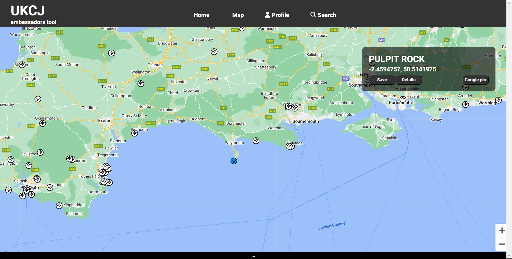
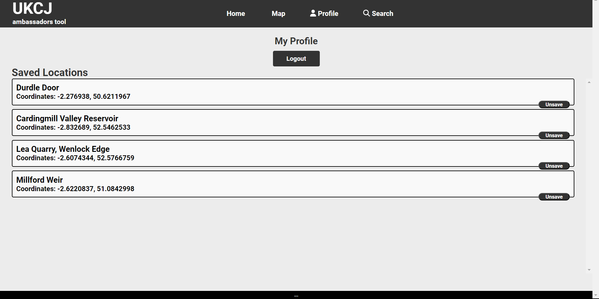
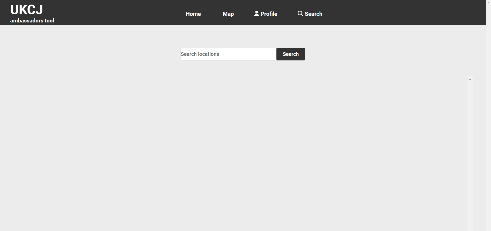
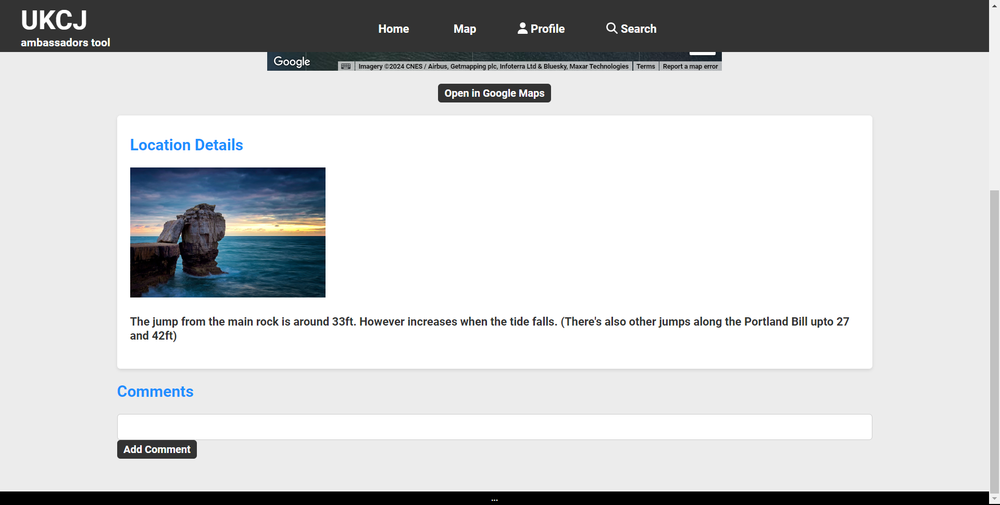
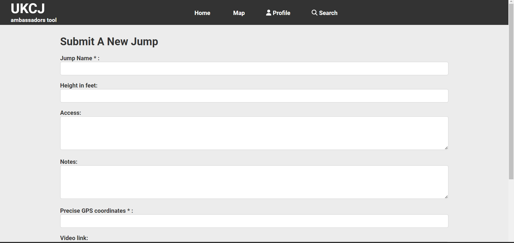

# UK Cliff Jumping Map

[Live Site](https://ukcj-map.com/)

## TABLE OF CONTENT

- [Project Overview](#project-overview)
- [User Experience (UX)](#user-experience-ux)
  - [Client Goals](#client-goals)
  - [Design](#design)
    - [Colours Used](#colours-used)
    - [Typography](#typography)
    - [Imagery](#imagery)
- [Actual Features](#actual-features)
- [Technologies Used](#technologies-used)
  - [Languages, Frameworks, Libraries \& Programs Used](#languages-frameworks-libraries--programs-used)
  - [Testing and Accesibility](#testing-and-accesibility)
    - [W3C Markup Validation Result](#w3c-markup-validation-result)
    - [W3C CSS Validation Result](#w3c-css-validation-result)
    - [JSHint](#jshint)
    - [Lighthouse](#lighthouse-report)
    - [Manual testing](#manual-testing)
- [Deployment](#deployment)
  - [Forking a Repository](#forking-a-repository)
  - [Cloning a Repository](#cloning-a-repository)
- [Credits](#credits)
  - [Code](#code)
- [Acknowledgments](#acknowledgments)

## Project Overview

 This application is a map-based platform designed to pin and provide information about all known cliff jumping locations in the United Kingdom. It aims to be the first map dedicated to detailing cliff jumping spots and provides users with a user-friendly and interactive interface.

## User Experience (UX)

Users can explore the map, view existing locations, save their favorite spots, and even leave comments and reviews for the locations they have visited. This allows users to share their analysis and experiences with others, creating a community-driven platform for cliff jumping enthusiasts.

#### Client Goals

- To inform users of the various cliff jumping locations around the UK
- Through using an interactive map they can visit the details pages of each location to see heights and dangers.
- Allow users to save favourite locations to their profile
- Users can comment on locations to add updates
  
- Deliver a seamless and user-friendly app navigation
  
## Design

### Colours used

- The chosen colors were picked to provide good contrast, the blue color also relates to the water element of cliff jumping

- **Primary Colors:**
  - Black: Used for borders, text, and background color of the footer.
  - White: Used for background color of buttons and some containers.
  - Blue (`#1e90ff`): Main accent color used for headers, links, and hover effects.
  - Dark Gray (`#333`): Background color of the header/nav, buttons, and some containers.
  - Light Gray (`#ececec`): Background color of the body.

### Typography

The primary font used throughout the project is **Roboto**, with a fallback to **Arial** and **Helvetica** for compatibility. The font-weight used is **700** to provide a bold and strong visual appearance.

## Actual Features

- Landing/Map page

  

- Profile Page

  

- Search page

  

- Details page

  

- Submit Locations page

  

## Technologies Used

### Languages, Frameworks, Libraries & Programs Used

- HTML5: to create the structure and content of the quiz.
- CSS contributes to the overall look and feel of the quiz, making it visually engaging for users.
- create-react-app: A popular tool for quickly setting up React applications.
- Vite: A fast build tool for modern web applications, used in conjunction with create-react-app for increased performance.
- TypeScript: A statically-typed superset of JavaScript, enhancing code quality and maintainability.
- Firebase: A backend-as-a-service platform used for user authentication and data storage.
  - [Github](https://github.com/) | Utilized as a repository for storing the project.
  - [GoogleMapReact](https://www.npmjs.com/package/google-map-react) | Used to integrate google maps into the maps page.
  - [Font Awesome](https://fontawesome.com/icons) | Used for the inclusion of icons within the project.
  - [Am I Responsive?](https://ui.dev/amiresponsive?) | Used to present the website's responsiveness across various devices.
  - [JSHint](https://jshint.com/) | Used to detect errors and potential issues in my JavaScript code.
  - [W3C CSS Validator](https://jigsaw.w3.org/css-validator/) | used to check the validity of my CSS code.
  

## Testing and Accesibility
  
The webapp was tested on different web browsers such as [Google Chrome](https://www.google.com/chrome/),[Microsoft edge](https://www.microsoft.com/en-us/edge?form=MA13L0)

#### W3C CSS Validation Result

- The CSS validation process revealed that i was using transform: uppercase which did not exist.

### Manual testing

- The map app was tested on different devices to verify its responsiveness.
- The user interface elements, such as buttons, question displays, and forms were tested to ensure they function as expected.
- The functionality of the profile page was tested along with all links and buttons associated to the saved locations component 
- The login and logout feature was tested 
- The response of onclick events was tested for the markers.

### Deployment

Firebase: 

- Run firebase deploy to deploy this project

#### Forking a Repository

1.Log in to GitHub and locate the repository that you want to fork.

2.Click on the 'Fork' button found on the top right of the repository page.

3.Select the destination where you want to fork the repository.

4.After forking is complete, you'll be redirected to your forked repository.

#### Cloning a Repository

1.On the GitHub repository page, click on the "Code" button and copy the repository URL provided.

2.Open your terminal and navigate to the directory where you want to clone the repository.

3.Use the 'git clone' command followed by the repository URL you copied and press 'Enter'

### Code

- [W3Schools](https://www.w3schools.com/)
  
- Youtube tutorials were used.These tutorials were instrumental in helping me understand how to effectively use JavaScript in the development.

## Contributing
Contributions to this project are welcome! If you have any ideas, improvements, or bug fixes, feel free to open an issue or submit a pull request on the project repository.

## License
This project is licensed under the [MIT License](LICENSE). Feel free to use, modify, and distribute the code as per the terms of the license.

### Acknowledgments

- The UKCJ facebook group for having me along on all your adventures and giving me a new hobby to enjoy.
- The create-react-app team and Vite maintainers for providing excellent tools for bootstrapping React projects.
- Firebase for the authentication and data storage capabilities.
- The BASE jumping community for their valuable input and contributions to the project.

## Contact
For any inquiries or feedback regarding the UK BASE Jumping Map application, please contact the project maintainer at jakelewisorton@gmail.com